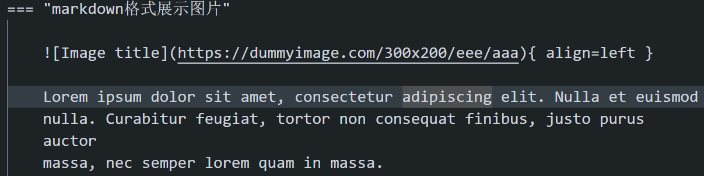

# Mkdocs Material 使用

> 某 🐷 写的

??? note "版本与升级"
    !!! tip

        版本升级须知：[https://squidfunk.github.io/mkdocs-material/upgrade/#upgrading-from-7x-to-8x](https://squidfunk.github.io/mkdocs-material/upgrade/#upgrading-from-7x-to-8x){target=_blank}
    
    ``` shell
    # 查看当前安装的版本号
    pip show mkdocs-material
    # 升级到最新版本
    pip install --upgrade mkdocs-material
    ```

## 建立文档

- 文件夹可以任意建立
- 但要想显示在网页中，记得修改总文件夹根目录下的 `mkdocs.yml` 文件
- 在 `nav` 下添加对应的文件名字即可 （语法是 `- 名字: 文件路径`）（注意空格，默认当前所处的文件夹在 `docs/`）

!!! note "注意"
    - <u>目录支持多级，但要注意当其所处位置不是最后一级（即其有子类的时候，其后不能跟有文件路径）</u>
    - 如下面第五行至第八行，后面都不能跟有文件路径，否则会报错

    ``` yaml linenums="1"
    nav:
    - Home: index.md
    - About: about.md
        - 你好: About/hello.md
    - Courses:
        - index1: 
          - index2:
            - index3:
              - file: Courses/index1/index2/index3/file.md
        - Courses: Courses/index.md #一般在文件夹下建立一个 index.md，并用同名来声明，可以表示这个文件夹的介绍
        - course1: 
            - courses1: Courses/course1/index.md
            - Lec01: Courses/course1/Lec01.md
        - course2:
            - courses2: Courses/course2/index.md
            - Lec01: Courses/course2/Lec01.md
    ```


> <u>文档只能有一个一级标题</u>

## 本地预览

- 在终端里面使用 `mkdocs serve` 命令, 然后点击他后面显示的链接（一般都是 `http://127.0.0.1:8000/`）
- 就可以在网页里面**实时**预览你的笔记
- 提交到静态页面直接在 `Note` 目录下执行 `build.sh` 脚本即可 -- （`./build.sh`）

## 显示术语提示

> 当鼠标置于术语上时，会显示术语的说明

=== "Show"

    The HTML specification is maintained by the W3C.
    
    *[HTML]: Hyper Text Markup Language
    *[W3C]: World Wide Web Consortium

=== "Code"

    ``` markdown
    The HTML specification is maintained by the W3C.
    
    *[HTML]: Hyper Text Markup Language
    *[W3C]: World Wide Web Consortium
    ```

## 引入独立的术语表（忽略）

!!! note
    显示效果跟上面示例1是一样的，区别是使用`--8<--`可以把术语的说明 独立在另外的文件，不必跟术语在同一文件中。

=== "Code"

    术语文件中引入术语表： `--8<-- "includes/abbreviations.md"`
    ``` markdown
    The HTML specification is maintained by the W3C.
    --8<-- "includes/abbreviations.md"
    ```

=== "Code"

    术语表:`includes/abbreviations.md`
    ``` markdown
    *[HTML]: Hyper Text Markup Language
    *[W3C]: World Wide Web Consortium
    ```

## 提示、警告栏

!!! success "注意"
    - 注意保持缩进和空行，主要是缩进
    - 标签下的内容都是在标签后面保有的缩进，且一般缩进都是四个空格

=== "note"

    !!! note
        默认 note 标签
    
    !!! note "标题"
        note 标签，带标题（注意标题用引号括住，和前面有空格）
    
    !!! note ""
        木有标题的 note 标签
    
    ``` markdown
    !!! note
    
        默认 note 标签
    
    !!! note "标题"
        note 标签，带标题（注意标题用引号括住，和前面有空格）
    
    !!! note ""
        木有标题的 note 标签
    ```

=== "abstract"

    !!! abstract
        abstract
    
    ``` markdown
    !!! abstract
        abstract
    ```

=== "info"
    
    !!! info
    
    ``` markdown
    !!! info
    ```

=== "tip"
    
    !!! tip
    
    ``` markdown
    !!! tip
    ```    

=== "success"
    
    !!! success
    
    ``` markdown
    !!! success
    ```       

=== "question"
    
    !!! question
    
    ``` markdown
    !!! question
    ```      

=== "warning"
    
    !!! warning
    
    ``` markdown
    !!! warning
    ```          

=== "failure"
    
    !!! failure
    
    ``` markdown
    !!! failure
    ```      

=== "danger"
    
    !!! danger
    
    ``` markdown
    !!! danger
    ```     

=== "bug"
    
    !!! bug
    
    ``` markdown
    !!! bug
    ```     

=== "example"
    
    !!! example
    
    ``` markdown
    !!! example
    ```     

=== "quote"
    
    !!! quote
    
    ``` markdown
    !!! quote
    ```     

## 按钮

=== "普通按钮"
    
    [Subscribe to our newsletter](#){ .md-button }
    
    ``` markdown
    [Subscribe to our newsletter](#){ .md-button }
    ```     

=== "primary 按钮"
    
    [Subscribe to our newsletter](#){ .md-button .md-button--primary }
    
    ``` markdown
    [Subscribe to our newsletter](#){ .md-button .md-button--primary }
    ```         

## 代码块

!!! success "注意"
    - 我在实践中发现代码块最好和上下内容之间都留有空行
    - 否则有可能会影响渲染，最简单的就是无论什么语言，都在代码块前后加上空行

=== "指定文件名"

    ``` py title="bubble_sort.py"
    def bubble_sort(items):
        for i in range(len(items)):
            for j in range(len(items) - 1 - i):
                if items[j] > items[j + 1]:
                    items[j], items[j + 1] = items[j + 1], items[j]
    ```
    
    ``` 
        ``` py title="bubble_sort.py"
        def bubble_sort(items):
            for i in range(len(items)):
                for j in range(len(items) - 1 - i):
                    if items[j] > items[j + 1]:
                        items[j], items[j + 1] = items[j + 1], items[j]
        ```
    ```

=== "显示行数"

    ``` py linenums="1"
    def bubble_sort(items):
        for i in range(len(items)):
            for j in range(len(items) - 1 - i):
                if items[j] > items[j + 1]:
                    items[j], items[j + 1] = items[j + 1], items[j]
    ```
    
    ``` 
        ``` py linenums="1"
        def bubble_sort(items):
            for i in range(len(items)):
                for j in range(len(items) - 1 - i):
                    if items[j] > items[j + 1]:
                        items[j], items[j + 1] = items[j + 1], items[j]
        ```
    ```

=== "指定某两行高亮"

    ``` py linenums="1" hl_lines="2 4"
    def bubble_sort(items):
        for i in range(len(items)):
            for j in range(len(items) - 1 - i):
                if items[j] > items[j + 1]:
                    items[j], items[j + 1] = items[j + 1], items[j]
    ```
    
    ``` 
        ``` py linenums="1" hl_lines="2 4"
        def bubble_sort(items):
            for i in range(len(items)):
                for j in range(len(items) - 1 - i):
                    if items[j] > items[j + 1]:
                        items[j], items[j + 1] = items[j + 1], items[j]
        ```
    ```

=== "指定连续行高亮"

    ``` py linenums="1" hl_lines="2-5"
    def bubble_sort(items):
        for i in range(len(items)):
            for j in range(len(items) - 1 - i):
                if items[j] > items[j + 1]:
                    items[j], items[j + 1] = items[j + 1], items[j]
    ```
    
    ``` 
        ``` py linenums="1" hl_lines="2-5"
        def bubble_sort(items):
            for i in range(len(items)):
                for j in range(len(items) - 1 - i):
                    if items[j] > items[j + 1]:
                        items[j], items[j + 1] = items[j + 1], items[j]
        ```
    ```

=== "去掉代码复制按钮"

    ``` { .python .no-copy }
    def bubble_sort(items):
        for i in range(len(items)):
            for j in range(len(items) - 1 - i):
                if items[j] > items[j + 1]:
                    items[j], items[j + 1] = items[j + 1], items[j]
    ```
    
    ```
        ``` { .python .no-copy }
        def bubble_sort(items):
            for i in range(len(items)):
                for j in range(len(items) - 1 - i):
                    if items[j] > items[j + 1]:
                        items[j], items[j + 1] = items[j + 1], items[j]
        ```
    ```

=== "点击显示代码注解"

    > 注意要使用对应语言的注解符号对 `(num)`进行注解，比如java的//、python的#
    
    ``` { .java .no-copy }
    Optional<String> message = Optional.ofNullable(record.value()); // (1)
    if (message.isPresent()) {
        System.out.println(message.get());
    }
    ```
    
    1.  :man_raising_hand: optional判空处理.
    
    ```
        ``` { .java .no-copy }
        Optional<String> message = Optional.ofNullable(record.value()); // (1)
        if (message.isPresent()) {
            System.out.println(message.get());
        }
        ```
    
        1.  :man_raising_hand: optional判空处理.
    ```

## 内容标签栏

=== "Show"

    === "C"
    
        ``` c
        #include <stdio.h>
    
        int main(void) {
        printf("Hello world!\n");
        return 0;
        }
        ```
    
    === "C++"
    
        ``` c++
        #include <iostream>
    
        int main(void) {
        std::cout << "Hello world!" << std::endl;
        return 0;
        }
        ```

=== "Code"
    - 注意缩进也是四个空格

    ``` 
    === "C"
    
        ``` c
        #include <stdio.h>
    
        int main(void) {
        printf("Hello world!\n");
        return 0;
        }
        ```
    
    === "C++"
    
        ``` c++
        #include <iostream>
    
        int main(void) {
        std::cout << "Hello world!" << std::endl;
        return 0;
        }
        ```
    ```

## 表格

!!! tip
    - 如果嫌弃麻烦，可以在 typora 中生成图表后，把代码粘贴过来

=== "Show"

    | Method      | Description                          |
    | :-----------: | :------------------------------------: |
    | `GET`       |      Fetch resource  |
    | `PUT`       |     Update resource |
    | `DELETE`    |     Delete resource |

=== "Code"

    ``` markdown
    | Method      | Description                          |
    | :-----------: | :------------------------------------: |
    | `GET`       |      Fetch resource  |
    | `PUT`       |     Update resource |
    | `DELETE`    |     Delete resource |
    ```

## 注脚

在本页的底部显示注脚内容

=== "Show"

    Lorem ipsum[^1] dolor sit amet, consectetur adipiscing elit.[^2]
    
    [^1]: Lorem ipsum dolor sit amet, consectetur adipiscing elit.
    [^2]: Lorem ipsum dolor sit amet, consectetur adipiscing elit.

=== "Code"

    ``` markdown
    Lorem ipsum[^1] dolor sit amet, consectetur adipiscing elit.[^2]
    
    [^1]: Lorem ipsum dolor sit amet, consectetur adipiscing elit.
    [^2]: Lorem ipsum dolor sit amet, consectetur adipiscing elit.
    ```

## 格式化处理

=== "删除线、下划线、注释、高亮"

    Text can be {--deleted--} and replacement text {++added++}. This can also be
    combined into {~~one~>a single~~} operation. {==Highlighting==} is also
    possible {>>and comments can be added inline<<}.
    
    {==
    
    Formatting can also be applied to blocks by putting the opening and closing
    tags on separate lines and adding new lines between the tags and the content.
    
    ==}
    
    - H~2~0
    - A^T^A

=== "Code"

    {: .zoom}
    ``` markdown 
    - H~2~0
    - A^T^A
    ``` 

## 图标

> 也可以直接粘贴表情

=== "Show"

    :smile:  :dart:

=== "Code"

    ``` markdown
    :smile:  :dart:
    ```

支持以下图标：

- :material-material-design: – [Material Design]
- :fontawesome-brands-font-awesome: – [FontAwesome]
- :octicons-mark-github-16: – [Octicons]
- github markdown：[https://github.com/zhangjw-THU/Emoji](https://github.com/zhangjw-THU/Emoji)
- github commit：[https://github.com/shafishcn/git-commit-emoji-cn](https://github.com/shafishcn/git-commit-emoji-cn)

[Material Design]: https://materialdesignicons.com/
[FontAwesome]: https://fontawesome.com/icons?d=gallery&m=free
[Octicons]: https://octicons.github.com/

## 图片

> 一般只需要知道 `[]() -> [图片名称（随意）](图片链接（绝对路径 or 相对路径）)`
> `VSCode` 中复制图片后，在 markdown 中使用 `ctrl + alt + v`
> 

=== "markdown格式展示图片"

    { align=left }
    
    Lorem ipsum dolor sit amet, consectetur adipiscing elit. Nulla et euismod
    nulla. Curabitur feugiat, tortor non consequat finibus, justo purus auctor
    massa, nec semper lorem quam in massa.
    
    ```markdown
    { align=left }
    
    Lorem ipsum dolor sit amet, consectetur adipiscing elit. Nulla et euismod
    nulla. Curabitur feugiat, tortor non consequat finibus, justo purus auctor
    massa, nec semper lorem quam in massa.
    ```

=== "添加图片说明"

    <figure markdown> 
        { width="300" }
        <figcaption>Image 说明</figcaption>
    </figure>
    
    ``` html
    <figure markdown> 
        { width="300" }
        <figcaption>Image 说明</figcaption>
    </figure>
    ```

=== "懒加载图片"

    { loading=lazy }
    
    ``` markdown
    { loading=lazy }
    ```

## 列表

> 好像在网页中显示出来缩进，代码都是要缩进四个空格或以上
> 我的 vscode 即使默认四个也不行，需要按两次 tab 才能做到
> 如果一次 tab 就可以做到就不需要在乎这个了（如果不行，建议 tab 两次）

=== "无序列表"
    - hello
        - world

    ``` markdown
    - hello
        - world
    ```

=== "有序列表"
    1. hello
        1. world
            1.  daidai

    ``` markdown
    1. hello
        1. world
            1.  daidai
    ```

=== "使用定义列表(没怎么用过这个)"

    `Lorem ipsum dolor sit amet`
    
    :   Sed sagittis eleifend rutrum. Donec vitae suscipit est. Nullam tempus
        tellus non sem sollicitudin, quis rutrum leo facilisis.
    
    `Cras arcu libero`
    
    :   Aliquam metus eros, pretium sed nulla venenatis, faucibus auctor ex. Proin
        ut eros sed sapien ullamcorper consequat. Nunc ligula ante.
    
        Duis mollis est eget nibh volutpat, fermentum aliquet dui mollis.
        Nam vulputate tincidunt fringilla.
        Nullam dignissim ultrices urna non auctor.
    
    ``` markdown
    `Lorem ipsum dolor sit amet`
    
    :   Sed sagittis eleifend rutrum. Donec vitae suscipit est. Nullam tempus
        tellus non sem sollicitudin, quis rutrum leo facilisis.
    
    `Cras arcu libero`
    
    :   Aliquam metus eros, pretium sed nulla venenatis, faucibus auctor ex. Proin
        ut eros sed sapien ullamcorper consequat. Nunc ligula ante.
    
        Duis mollis est eget nibh volutpat, fermentum aliquet dui mollis.
        Nam vulputate tincidunt fringilla.
        Nullam dignissim ultrices urna non auctor.
    ```        

=== "任务列表"

    - [x] Lorem ipsum dolor sit amet, consectetur adipiscing elit
    - [ ] Vestibulum convallis sit amet nisi a tincidunt
        * [x] In hac habitasse platea dictumst
        * [x] In scelerisque nibh non dolor mollis congue sed et metus
        * [ ] Praesent sed risus massa
    - [ ] Aenean pretium efficitur erat, donec pharetra, ligula non scelerisque
    
    ``` markdown
    - [x] Lorem ipsum dolor sit amet, consectetur adipiscing elit
    - [ ] Vestibulum convallis sit amet nisi a tincidunt
        * [x] In hac habitasse platea dictumst
        * [x] In scelerisque nibh non dolor mollis congue sed et metus
        * [ ] Praesent sed risus massa
    - [ ] Aenean pretium efficitur erat, donec pharetra, ligula non scelerisque
    ```

---

> 以下不需要知道

## metadata 设置

可以设置特定的key-value到markdown文档中，mkdocs再进行对应解析

=== "页面标题"
    ``` markdown
    ---
    title: Lorem ipsum dolor sit amet 

    ---
    
    # Document title
    ...
    ```

=== "页面描述"
    ``` markdown
    ---
    description: Nullam urna elit, malesuada eget finibus ut, ac tortor. 

    ---
    
    # Document title
    ...
    ```

=== "隐藏nav、toc"

    ``` markdown
    ---
    hide:
        - navigation
        - toc
    ---
    
    # Document title
    ```

=== "隐藏评论"

    请先看第10点详细说明。
    ``` markdown
    ---
    vssue: ""
    ---
    
    # Document title
    ...
    ```

!!! note "metadata"
    - `metadata` 都是加在文档的最前面，用两行 `---` 包围住
    - 一般情况并不需要设置这个，文档标题就是一级标题
    - 如果想要加密某个文件，就加一个 `password: 88888888`
    - 即

    ```
    ---
    password: 88888888
    ---
    ```
    
    - 其他 metadata 基本不需要

!!! quote
    - 大部分内容摘录自 [shafish](https://shafish.cn/blog/mkdocs/)